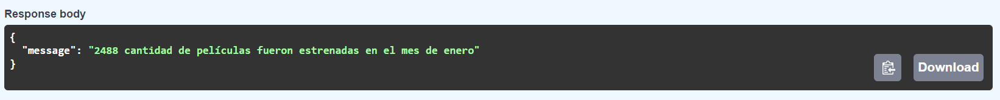

### **DESCRIPCION**
Sistema de recomendacion de peliculas deployando una API en RENDER junto a otras 6 funciones utiles para la consulta y analisis de datos.
### **TABLA DE CONTENIDO**
## Tabla de contenido
1. [Introducción](#introducción)
2. [Instalación y Requisitos](#instalación-y-requisitos)
3. [Estructura del Proyecto](#estructura-del-proyecto)
4. [Uso y Ejecución](#uso-y-ejecución)
5. [Datos y Fuentes](#datos-y-fuentes)
6. [Metodología](#metodología)
7. [Resultados y Conclusiones](#resultados-y-conclusiones)
8. [Contribución y Colaboración](#contribución-y-colaboracion)
9. [Autores](#autores)
### **INTRODUCCIÓN**
La capacidad que las maquinas que tienen para aprender hoy en dia son impresionantes, variando sus usos desde el uso en vias para poder analizar el estado de la carretera hasta la comodidad de tu casa en donde a diario encontrarás decenas peliculas basadas en tus gustos recomendadas por tu plataforma de confianza. Esto ultimo lo trabajaremos en este proyecto, generando un MVP y observando sus resultados. Dicho esto ¿Por donde empezamos?

### **INSTALACIÓN Y REQUISITOS**
- Python 3.7 o superior
- Todas las librerias usadas las encuentras en el archivo "requirements.txt"
### **ESTRUCTURA DEL PROYECTO**

### **USO Y EJECUCIÓN**
 1. Abrir link https://movies-and-credits.onrender.com y presionar boton de 'Comienzo' (Si la pagina no carga intentar de nuevo en 5 min)
 2. Encontraras 8 diferentes recuadros identificados con la palabra 'GET' ignoraremos el primero, vamos a trabajar con los 7 siguientes.
 3. Al desplegar cada recuadro encontraremos el boton 'try it out' donde se nos permitirá escribir el dato de entrada.
 4. Al ejecutar la salida deberia verse de la siguiente manera (caso de ejemplo):
    
### **DATOS Y FUENTES**
- [FastAPI-Render](https://github.com/orestes-victor/Repositorio_guia_para_fastAPI_y_RENDER)
- (S/f). Unirioja.es. Recuperado el 8 de julio de 2024, de [https://dialnet.unirioja.es/servlet/articulo?codigo=7242764](https://dialnet.unirioja.es/servlet/articulo?codigo=7242764)
- [Exploratory Data Analysis with Pandas Python](https://www.youtube.com/watch?v=xi0vhXFPegw)
### **METODOLOGÍA**
Podrás revisar un poco de lo llevado a cabo en el siguiente video https://youtu.be/kiX8tswhhYc
### **RESULTADOS Y CONCLUSIONES**
- Luego de realizar el EDA observamos algunos valores nulos en la columna return que podria indicarnos al parecer que deberian ser eliminados, sin embarago estos valores resultan de importancia ya que si bien tiene valores nulos, su contenido puede tener valores de interes para nuestro modelo de ML como datos acerca de la compañia de las peliculas o su popularidad.
- Los valores outliers no tienen porque ser descartados del todo. Se comprobó que los valores fuera de lo comun que estaban por encima de la media resultaban ser de utilidad para el aprendizaje del modelo de recomendacion.
- El nivel de peliculas realizadas aumento con el tiempo. Esto nos hace plantear dos posibles hipotesis del origen de los datos: 1. El estudio centró sus esfuerzos en encontrar datos de peliculas modernas y relevantes. 2. El estudio no tuvo prejuicios de evaluacion lo que revelaria el posible aumento de la producción de peliculas a causa de la creciente modernizacion tecnologica que este sector ha tenido.
### **CONTRIBUCIÓN Y COLABORACION**
¡Gracias por considerar contribuir a este proyecto! Valoramos y damos la bienvenida a las contribuciones de la comunidad. Si tienes ideas para mejorar la estructura del proyecto o cualquier otra sugerencia, no dudes en proponer cambios.
### **AUTORES**
Gustavo Pardo Bermudez / Estudiante- SoyHenry

